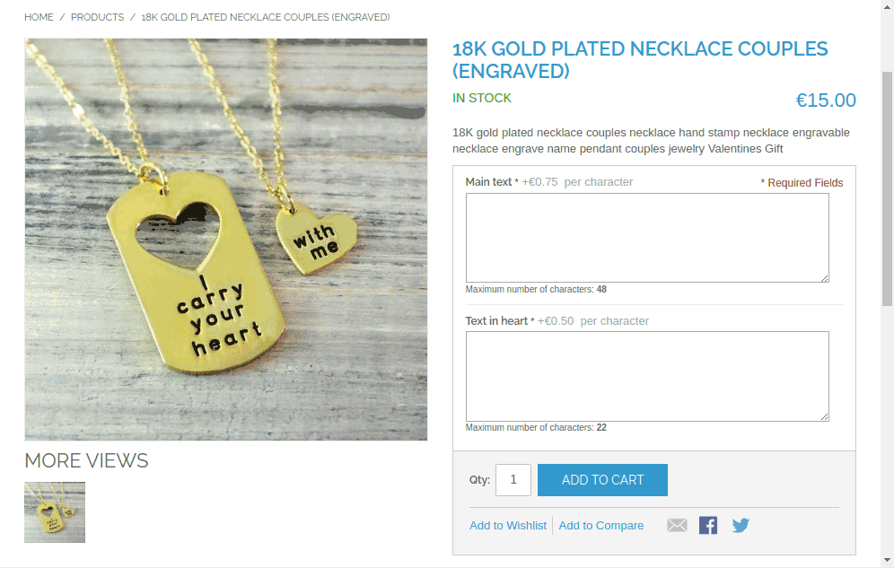
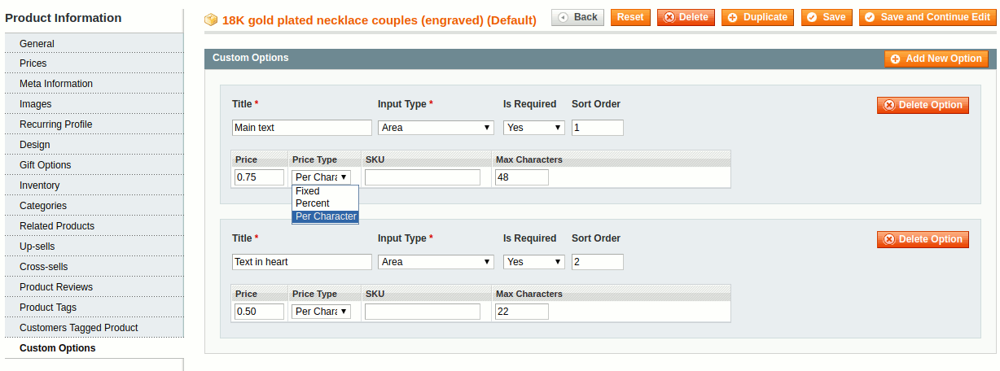

# Engraving Costs Module for Magento

## Description
Magento's custom product options can add a *fixed price* or a *percentage* to the total cost of a product. With this module you get a third one: a price **Per Character**. This means the option price is multiplied by the length of the text entered into the input field. This is useful for custom engravable products, where customers need to pay a surcharge per character they want engraved.

The product price is calculated on-the-fly by the JavaScript while the customer enters the text, and once more by the PHP code when the product is added to the cart.

Because the calculation itself hooks into Magento's core JavaScript code, multiple custom options can easily be combined. The module should be compatible with most custom front-end themes without any need for modifications.

## Usage
1. Login to the Magento Admin Panel and create or edit a product.
2. Create or edit a custom option with input type **Text Field** or **Text Area**.
3. Under price, enter the cost of one character, and select **Per Character** as price type.
4. Save the product and try it out on the front-end.

## Installation

Install the module files using one of the following three methods:

### - Install files via composer
- Install [composer](http://getcomposer.org/download/)
- Install [magento composer installer](https://github.com/Cotya/magento-composer-installer)
- Use this command from your Magento installation folder:

  `composer require bastiaanh/magento-engraving-costs`

### - Install files via modman
- Install [modman](https://github.com/colinmollenhour/modman)
- Use this command from your Magento installation folder:

  `modman clone https://github.com/bastiaanh/magento-engraving-costs/`

### - Install files manually
You can copy the files from the `src/` folder of this repository to the same folders of your installation

Once the files are installed:

- Clear the cache, logout from the admin panel and then login again.

## Uninstallation
- Make sure there are no more custom options with price type 'perchar':

  `UPDATE catalog_product_option_price SET price_type = 'fixed' WHERE price_type = 'perchar';`

- Remove all extension files from your Magento installation.
- Via composer:

  `composer remove bastiaanh/magento-engraving-costs`

- Via modman:

  `modman remove BastiaanH_EngravingCosts`

## Requirements
- PHP >= 5.3.0

## Compatibility
- Magento CE >= 1.6 and < 2.0
- Magento EE >= 1.11 and < 2.0

## Support
If you have any issues with this extension, feel free to open an issue on [GitHub](https://github.com/BastiaanH/magento-engraving-costs/issues).

## Contribution
All contributions are highly appreciated. The best way to contribute code is to open a [pull request on GitHub](https://help.github.com/articles/using-pull-requests).

## License
The project is licensed under the MIT license.
